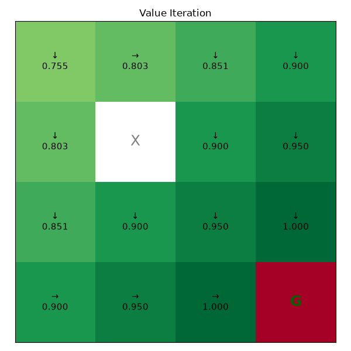
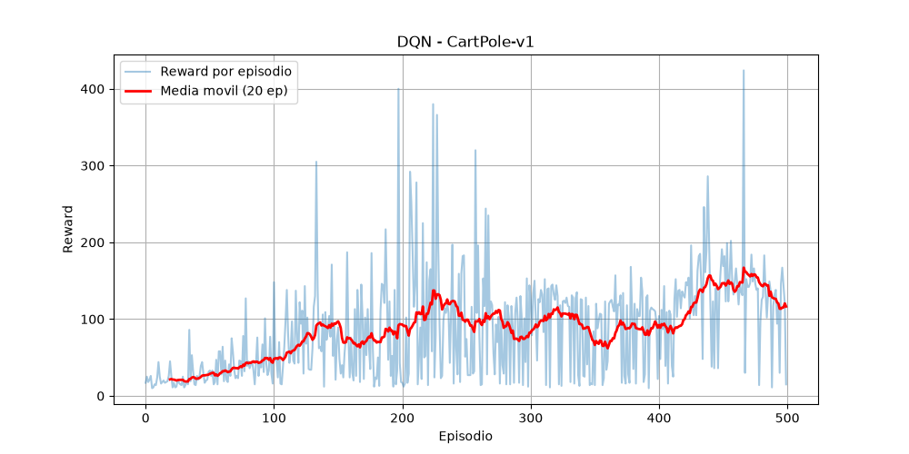
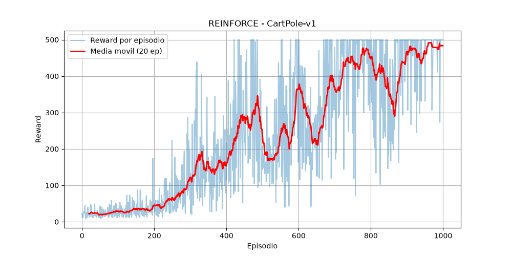
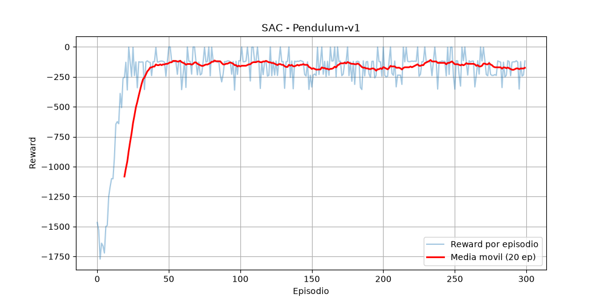
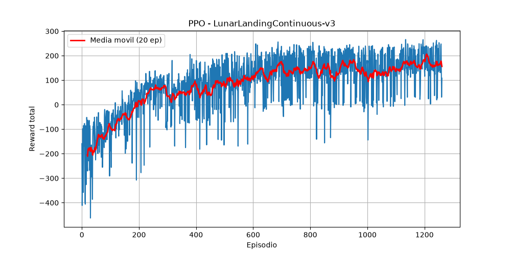

# Deep Reinforcement Learning Portfolio

Implementation of classical and deep reinforcement learning algorithms from scratch in PyTorch, progressing from tabular methods to modern policy optimization and LLM fine-tuning with RLHF.

----

## Requirements

- Python >= 3.8 
- PyTorch >= 2.0.0
- Gymnasium >= 0.29.0
- NumPy >= 1.22.0
- Matplotlib >= 3.5.0

For RLHF only:
- Transformers >= 4.30.0
- TRL >= 0.7.0
- Datasets >= 2.0.0
- Accelerate >= 0.20.0

---

## Algorithms

### Classical RL (Tabular)
| Algorithm | Environment | On/Off Policy | Convergence |
|-----------|-------------|---------------|-------------|
| Value Iteration | Gridworld 4×4 | — | Guaranteed (DP) |
| Monte Carlo | Gridworld 4×4 | On-policy | Asymptotic |
| SARSA | Gridworld 4×4 | On-policy | Guaranteed* |
| Q-Learning | Gridworld 4×4 | Off-policy | Guaranteed* |

*Under standard conditions: all state-action pairs visited infinitely often, learning rate satisfying Robbins-Monro conditions: $\sum_t \alpha_t = \infty$ and $\sum_t \alpha_t^2 < \infty$.

### Deep RL
| Algorithm | Environment | On/Off Policy | Action Space |
|-----------|-------------|---------------|--------------|
| DQN | CartPole-v1 | Off-policy | Discrete |
| REINFORCE | CartPole-v1 | On-policy | Discrete |
| SAC | Pendulum-v1 | Off-policy | Continuous |
| PPO | LunarLanderContinuous-v3 | On-policy | Continuous |

### LLM Fine-tuning
| Method | Model | Task |
|--------|-------|------|
| RLHF (PPO) | GPT-2 | Positive sentiment generation |

---

## Environments

### Gridworld 4×4
- **States**: 16 discrete states (cells), 1 obstacle (state 5), 1 goal (state 15)
- **Actions**: 4 discrete (UP, DOWN, LEFT, RIGHT)
- **Reward**: +1.0 on reaching goal, −0.04 per step
- **Discount**: $\gamma = 0.99$

### CartPole-v1
- **States**: 4 continuous values — cart position $x$, cart velocity $\dot{x}$, pole angle $\theta$, pole angular velocity $\dot{\theta}$
- **Actions**: 2 discrete (push left, push right)
- **Reward**: +1 per timestep the pole remains upright
- **Episode termination**: $|\theta| > 12°$, $|x| > 2.4$, or 500 steps reached
- **Solved**: average reward $\geq 475$ over 100 consecutive episodes

### Pendulum-v1
- **States**: 3 continuous values $(\cos\theta, \sin\theta, \dot{\theta})$ — angle encoded as unit vector to avoid discontinuity at $\pm\pi$
- **Actions**: 1 continuous torque $u \in [-2, 2]$
- **Reward**: $r = -(\theta^2 + 0.1\dot{\theta}^2 + 0.001u^2)$ per step, maximum 0
- **Episode length**: fixed 200 steps

### LunarLanderContinuous-v3
- **States**:: 8 continuous values (position $x/y$, velocity $x/y$, angle, angular velocity, leg contacts)
- **Actions**: 2 continuous values (main engine throttle, lateral engine throttle) in $[-1, 1]$
- **Reward**: +100/−100 for landing/crashing, −0.3 per frame main engine firing
- **Solved**: average reward $\geq 200$ over 100 consecutive episodes

---
## Algorithm Details

### Value Iteration
Model-based dynamic programming. Applies the Bellman optimality operator $\mathcal{T}^*$ iteratively:

$$V_{k+1}(s) = (\mathcal{T}^* V_k)(s) = \max_a \sum_{s'} p(s'|s,a)\left[r(s,a,s') + \gamma V_k(s')\right]$$

$\mathcal{T}^*$ is a contraction mapping on $(B(S), \|\cdot\|_\infty)$ with contraction factor $\gamma < 1$. By Banach's fixed point theorem, $V_k \to V^*$ geometrically at rate $\gamma^k$, regardless of initialization. Terminates when $\|V_{k+1} - V_k\|_\infty < \theta$. Requires full knowledge of $p(s'|s,a)$. Complexity $O(|S|^2|A|)$ per iteration.

### Monte Carlo
Model-free, episodic. Estimates $Q^\pi(s,a)$ as the sample mean of observed returns under first-visit or every-visit schemes:

$$Q(s,a) \leftarrow \frac{1}{N(s,a)} \sum_{i=1}^{N(s,a)} G_t^{(i)}, \qquad G_t = \sum_{k=0}^{T-t-1} \gamma^k r_{t+k+1}$$

By the law of large numbers, $\hat{Q}(s,a) \to Q^\pi(s,a)$ as $N(s,a) \to \infty$. Uses $\varepsilon$-greedy policy improvement. Requires episodic tasks. High variance due to full-trajectory returns; unbiased estimator of $Q^\pi$.

### SARSA (On-policy TD)
Model-free, bootstrapped TD(0) control. Updates using the tuple $(s, a, r, s', a')$ where $a' \sim \pi(\cdot|s')$:

$$Q(s,a) \leftarrow Q(s,a) + \alpha\left[r + \gamma Q(s',a') - Q(s,a)\right]$$

The TD target $r + \gamma Q(s',a')$ bootstraps from the current estimate, introducing bias but reducing variance relative to Monte Carlo. On-policy: the policy evaluated and improved is the same $\varepsilon$-greedy policy used to generate data. Converges to $Q^*$ under Robbins-Monro conditions and GLIE (Greedy in the Limit with Infinite Exploration).

### Q-Learning (Off-policy TD)
Model-free, bootstrapped. Decouples behavior policy from target policy by using the greedy action in the update:

$$Q(s,a) \leftarrow Q(s,a) + \alpha\left[r + \gamma \max_{a'} Q(s',a') - Q(s,a)\right]$$

Off-policy: learns $Q^*$ directly regardless of the exploration policy used to generate data. The $\max$ operator introduces a maximization bias — $\mathbb{E}[\max_a Q(s,a)] \geq \max_a \mathbb{E}[Q(s,a)]$ — which Double Q-Learning corrects by decoupling action selection from action evaluation. Converges to $Q^*$ under the same conditions as SARSA.

---
### DQN (Deep Q-Network)
Extends Q-Learning to continuous state spaces using a neural network $Q_\theta(s,a) \approx Q^*(s,a)$. Naive application of Q-Learning with function approximation is unstable due to correlated updates and a non-stationary target. Two stabilization mechanisms:

**Experience Replay**: transitions $(s,a,r,s')$ are stored in a replay buffer $\mathcal{D}$ of fixed capacity. Minibatches are sampled uniformly at random, breaking temporal correlations. By the law of large numbers, the gradient estimate converges to the true gradient as batch size increases:

$$\nabla_\theta \mathcal{L}(\theta) \approx \frac{1}{B}\sum_{i=1}^B \left(r_i + \gamma \max_{a'} Q_{\theta^-}(s_i',a') - Q_\theta(s_i,a_i)\right) \nabla_\theta Q_\theta(s_i,a_i)$$

**Target Network**: a frozen copy $Q_{\theta^-}$ with parameters updated every $C$ steps prevents the target from shifting every gradient step, stabilizing the optimization landscape. The full loss is:

$$\mathcal{L}(\theta) = \mathbb{E}_{(s,a,r,s') \sim \mathcal{D}}\left[\left(r + \gamma \max_{a'} Q_{\theta^-}(s',a') - Q_\theta(s,a)\right)^2\right]$$

No theoretical convergence guarantee with neural function approximation (deadly triad: function approximation + bootstrapping + off-policy).

### REINFORCE (Policy Gradient)
Directly parametrizes and optimizes the policy $\pi_\theta$. The objective is:

$$J(\theta) = \mathbb{E}_{\tau \sim \pi_\theta}\left[\sum_{t=0}^T \gamma^t r_t\right] = \mathbb{E}_{s_0 \sim \rho_0}[V^{\pi_\theta}(s_0)]$$

The Policy Gradient Theorem gives an exact expression for $\nabla_\theta J(\theta)$ that does not require differentiating through the environment dynamics:

$$\nabla_\theta J(\theta) = \mathbb{E}_{\tau \sim \pi_\theta}\left[\sum_{t=0}^T \nabla_\theta \log \pi_\theta(a_t|s_t) \cdot G_t\right]$$

This follows from the log-derivative trick: $\nabla_\theta \pi_\theta(\tau) = \pi_\theta(\tau) \nabla_\theta \log \pi_\theta(\tau)$, and the fact that $\nabla_\theta \log p(s_0) = 0$ and $\nabla_\theta \log p(s_{t+1}|s_t,a_t) = 0$. The estimator is unbiased but has high variance. Returns are normalized to stabilize training:

$$\tilde{G}_t = \frac{G_t - \mu_G}{\sigma_G + \varepsilon}$$

On-policy: data must be generated by the current $\pi_\theta$; all experience is discarded after each update.

### SAC (Soft Actor-Critic)
Off-policy Actor-Critic for continuous action spaces. Augments the standard RL objective with a maximum entropy term:

$$J(\pi) = \mathbb{E}_{\tau \sim \pi}\left[\sum_{t=0}^\infty \gamma^t \left(r(s_t,a_t) + \alpha H(\pi(\cdot|s_t))\right)\right]$$

where $H(\pi(\cdot|s)) = -\mathbb{E}_{a \sim \pi}[\log \pi(a|s)]$ is the Shannon entropy and $\alpha > 0$ is the temperature parameter. The soft Bellman equations are:

$$Q^\pi(s,a) = r(s,a) + \gamma \mathbb{E}_{s' \sim p}[V^\pi(s')]$$
$$V^\pi(s) = \mathbb{E}_{a \sim \pi}[Q^\pi(s,a)] + \alpha H(\pi(\cdot|s))$$

The optimal soft policy is the Boltzmann distribution over Q-values:

$$\pi^{\star}(a|s) \propto \exp\!\left(\frac{1}{\alpha} Q^{\star}(s,a)\right)$$

As $\alpha \to 0$ this recovers the deterministic greedy policy; as $\alpha \to \infty$ it converges to the uniform distribution. In practice $\pi_\theta$ is a Gaussian with state-dependent mean and variance, sampled via the **reparameterization trick**:

$$a = \mu_\theta(s) + \sigma_\theta(s) \cdot \varepsilon, \quad \varepsilon \sim \mathcal{N}(0,I)$$

making the sampling operation differentiable. **Clipped Double-Q** mitigates overestimation bias: two independent critics $Q_{\theta_1}, Q_{\theta_2}$ are trained and the minimum is used for targets:

$$y = r + \gamma\left(\min_{i=1,2} Q_{\theta_i^-}(s',a') - \alpha \log \pi_\theta(a'|s')\right)$$

Target networks are updated via soft updates: $\theta_i^- \leftarrow \tau\theta_i + (1-\tau)\theta_i^-$ with $\tau \ll 1$, providing smoother target evolution than the hard updates of DQN.

### PPO (Proximal Policy Optimization)
On-policy Actor-Critic. The core problem with naive policy gradient methods is that large updates can collapse performance catastrophically — the new policy may fall outside the region where the gradient estimate is valid, since the estimate uses samples from $\pi_{\theta_{old}}$.

**TRPO** (the precursor to PPO) formalizes this as a constrained optimization problem:

$$\max_\theta \mathbb{E}_t\left[\frac{\pi_\theta(a_t|s_t)}{\pi_{\theta_{old}}(a_t|s_t)} \hat{A}_t\right] \quad \text{subject to} \quad \mathbb{E}_t\left[D_{KL}(\pi_{\theta_{old}}(\cdot|s_t) \| \pi_\theta(\cdot|s_t))\right] \leq \delta$$

PPO replaces the hard constraint with a soft penalty via clipping. Let $r_t(\theta) = \frac{\pi_\theta(a_t|s_t)}{\pi_{\theta_{old}}(a_t|s_t)}$ be the probability ratio. The clipped surrogate objective is:

$$\mathcal{L}^{CLIP}(\theta) = \mathbb{E}_t\left[\min\left(r_t(\theta)\hat{A}_t,\ \mathrm{clip}(r_t(\theta), 1-\varepsilon, 1+\varepsilon)\hat{A}_t\right)\right]$$

When $\hat{A}_t > 0$ the clip prevents $r_t(\theta)$ from exceeding $1+\varepsilon$, bounding the incentive to increase the action probability. When $\hat{A}_t < 0$ it prevents $r_t(\theta)$ from going below $1-\varepsilon$, bounding the incentive to decrease it. This is a pessimistic lower bound on the unclipped objective.

**Generalized Advantage Estimation (GAE)** reduces variance of the advantage estimate by exponentially weighting TD residuals:

$$\hat{A}_t^{GAE(\gamma,\lambda)} = \sum_{l=0}^{\infty} (\gamma\lambda)^l \delta_{t+l}, \qquad \delta_t = r_t + \gamma V_\phi(s_{t+1}) - V_\phi(s_t)$$

$\lambda \in [0,1]$ interpolates between TD(0) ($\lambda=0$, low variance, high bias) and Monte Carlo ($\lambda=1$, high variance, zero bias). The critic targets are set as $\hat{A}_t + V_{\phi}(s_t)$ and the critic is trained by minimizing:

$$\mathcal{L}^{VF}(\phi) = \mathbb{E}_t\left[\left(V_\phi(s_t) - (\hat{A}_t + V_\phi^{old}(s_t))\right)^2\right]$$

The full objective also includes an entropy bonus $\mathcal{L}^{ENT}(\theta) = \mathbb{E}_t[H(\pi_\theta(\cdot|s_t))]$ to encourage exploration. An approximate KL divergence $\hat{D}_{KL} = \mathbb{E}_t[(r_t(\theta)-1) - \log r_t(\theta)]$ is monitored as an early stopping criterion per epoch.

**KL divergence bound**: the approximate KL between the old and new policy is:

$$\hat{D}_{KL}(\pi_{\theta_{old}} \| \pi_{\theta}) = \mathbb{E}_t\left[(r_t(\theta) - 1) - \log r_t(\theta)\right]$$

This approximation follows from the second-order Taylor expansion of $D_{KL}$ around $r_t = 1$: since $\log x \leq x - 1$ for all $x > 0$, the quantity $(r_t - 1) - \log r_t \geq 0$ always, making it numerically stable. If $\hat{D}_{KL}$ exceeds a threshold $\delta$ at any epoch, training stops early for that iteration — this is a softer alternative to TRPO's hard constraint, preserving the computational simplicity of first-order optimization while still bounding policy change.

### RLHF (Reinforcement Learning from Human Feedback)
Three-stage pipeline for aligning LLMs with human preferences:

**Stage 1 — Supervised Fine-Tuning (SFT)**: minimize cross-entropy on demonstration data $\mathcal{D}_{demo}$:

$$\mathcal{L}^{SFT}(\theta) = -\mathbb{E}_{(x,y) \sim \mathcal{D}_{demo}}\left[\sum_t \log \pi_\theta(y_t|x, y_{<t})\right]$$

**Stage 2 — Reward Model**: given preference pairs $(x, y_w, y_l)$ where $y_w \succ y_l$, train $r_\phi$ via the Bradley-Terry model:

$$\mathcal{L}^{RM}(\phi) = -\mathbb{E}_{(x,y_w,y_l)}\left[\log \sigma(r_\phi(x,y_w) - r_\phi(x,y_l))\right]$$

**Stage 3 — PPO with KL penalty**: optimize the LM policy subject to a KL constraint from the SFT reference model $\pi_{ref}$:

$$\max_\pi \mathbb{E}_{x \sim \mathcal{D}, y \sim \pi(\cdot|x)}\left[r_\phi(x,y) - \beta D_{KL}[\pi(\cdot|x) \| \pi_{ref}(\cdot|x)]\right]$$

The KL term prevents **reward hacking**: without it the policy may exploit artifacts in $r_\phi$ to achieve high reward while generating degenerate text. $\beta$ controls the exploitation-alignment tradeoff. Implemented with TRL using GPT-2 and a DistilBERT sentiment classifier as proxy reward model.

---
## Results

### Value Iteration & Classical RL — Gridworld 4×4


### DQN — CartPole-v1


### REINFORCE — CartPole-v1


### SAC — Pendulum-v1


### PPO — LunarLanderContinuous-v3


---

## Installation

```bash
git clone https://github.com/MartinDS11/deep-rl.git
cd deep-rl
pip install -r requirements.txt
```

---

## Usage

### Run experiments

```bash
# Classical RL
python experiments/train_classical.py

# Deep RL
python experiments/train_dqn.py
python experiments/train_reinforce.py
python experiments/train_sac.py
python experiments/train_ppo.py

# RLHF (requires GPU, recommended: Google Colab)
python experiments/train_rlhf.py
```

### Import as library

```python
from algorithms.dqn import DQNAgent
from algorithms.reinforce import REINFORCEAgent
from algorithms.sac import SACAgent
from algorithms.ppo import PPO
from algorithms.classical import montecarlo, value_iteration, sarsa, q_learning

import gymnasium as gym

# DQN example
env = gym.make('CartPole-v1')
agent = DQNAgent(state_dim=4, action_dim=2)

# SAC example
env = gym.make('Pendulum-v1')
agent = SACAgent(state_dim=3, action_dim=1, action_limit=2.0)
```

---

## Project Structure

    deep-rl/
    ├── algorithms/
    │   ├── classical/
    │   │   ├── gridworld.py
    │   │   ├── value_iteration.py
    │   │   ├── montecarlo.py
    │   │   ├── sarsa.py
    │   │   └── q_learning.py
    │   ├── dqn/
    │   │   ├── agent.py
    │   │   ├── network.py
    │   │   └── replay_buffer.py
    │   ├── reinforce/
    │   │   └── agent.py
    │   ├── sac/
    │   │   ├── agent.py
    │   │   └── networks.py
    │   ├── ppo/
    │   │   ├── ppo.py
    │   │   └── network.py
    │   └── rlhf/
    │       └── trainer.py
    ├── experiments/
    │   ├── train_classical.py
    │   ├── train_dqn.py
    │   ├── train_reinforce.py
    │   ├── train_sac.py
    │   ├── train_ppo.py
    │   └── train_rlhf.py
    ├── results/
    ├── requirements.txt
    ├── setup.py
    └── README.md

---

## References

- **DQN**: Mnih et al. (2015). [Human-level control through deep reinforcement learning](https://www.nature.com/articles/nature14236). *Nature*.
- **REINFORCE**: Williams (1992). [Simple statistical gradient-following algorithms for connectionist reinforcement learning](https://link.springer.com/article/10.1007/BF00992696). *Machine Learning*.
- **SAC**: Haarnoja et al. (2018). [Soft Actor-Critic: Off-Policy Maximum Entropy Deep Reinforcement Learning with a Stochastic Actor](https://arxiv.org/abs/1801.01290). *ICML*.
- **PPO**: Schulman et al. (2017). [Proximal Policy Optimization Algorithms](https://arxiv.org/abs/1707.06347). *arXiv*.
- **GAE**: Schulman et al. (2015). [High-Dimensional Continuous Control Using Generalized Advantage Estimation](https://arxiv.org/abs/1506.02438). *ICLR*.
- **TRPO**: Schulman et al. (2015). [Trust Region Policy Optimization](https://arxiv.org/abs/1502.05477). *ICML*.
- **RLHF**: Ouyang et al. (2022). [Training language models to follow instructions with human feedback](https://arxiv.org/abs/2203.02155). *NeurIPS*.
- **Sutton & Barto**: [Reinforcement Learning: An Introduction](http://incompleteideas.net/book/the-book-2nd.html). MIT Press.
- **Shiyu Zhao**: [Mathematical Foundations of Reinforcement Learning](https://github.com/MathFoundationRL/Book-Mathematical-Foundation-of-Reinforcement-Learning). Springer.